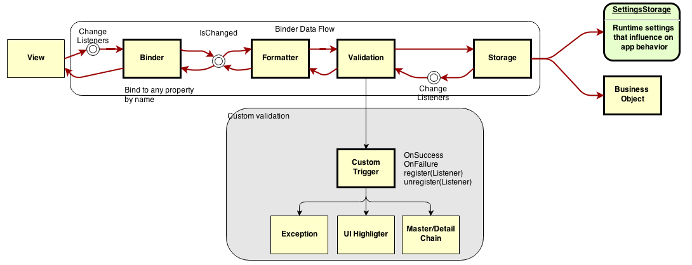

binding-tc
==========

Android View properties binding to the Business Objects (POJO). 

Goals
======
* High performance, 
* easy syntax, 
* minimalistic approach, 
* highly customizable,
* hamcrest validation syntax,
* 100% covered by unit tests
 
Concept Overview
================

Binding In Details
==================

