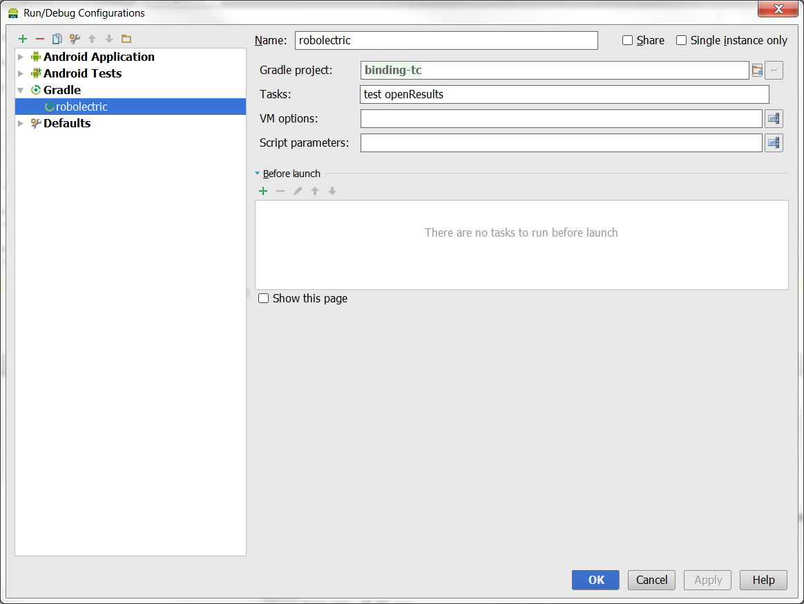
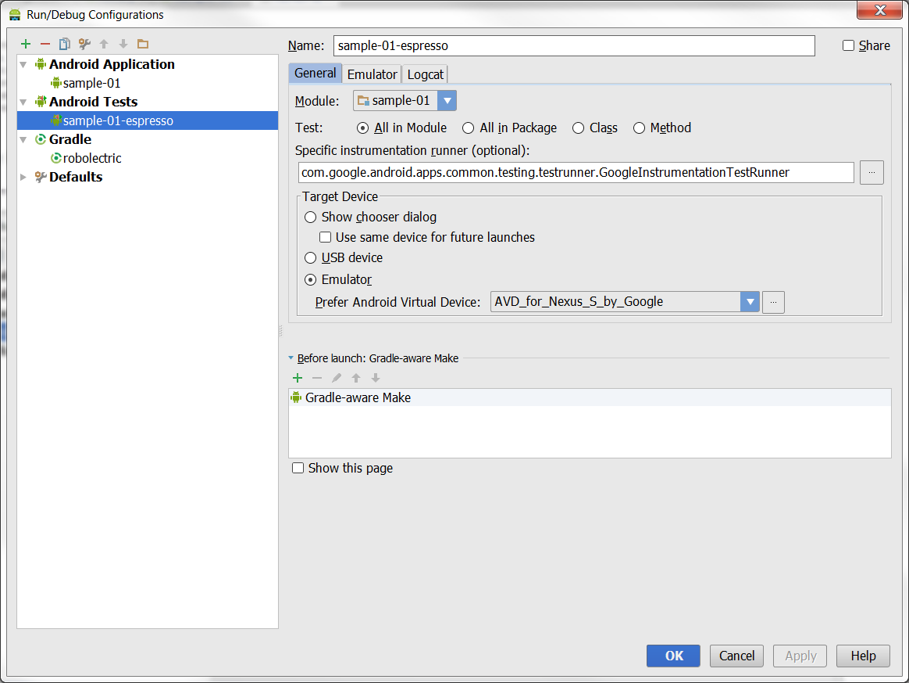

# binding-tc

*Second Name:* Android Easy Binding (AEB)

Android View properties binding to the Business Objects (POJO). 

# State [](https://travis-ci.org/OleksandrKucherenko/binding-tc)

Active development, started at: 2014-05-15

# Goals
* High performance, 
* easy syntax, 
* minimalistic approach, 
* highly customizable,
* hamcrest validation syntax,
* 100% covered by unit tests, TDD

#Prepare Environment

For development used latest Android Studio with gradle build scripts. For TDD used two frameworks: Robolectric and Espresso.

| *Robolectric Tests Executor* | *Espresso Tests Executor* |
|------------------------------|---------------------------|
|  |  |

#Binding In Details


# Example of Usage
Typical Business Object declared in POJO way:

```java
  public static class User{
    private String mLogin;
    private String mPassword;
  
    public String getLogin(){ return mLogin; }
    public String getPassword(){ return mPassword; }
  }
```
Fragment binding:

```java
import com.truecaller.ui.binding.BindingManager;

import static com.truecaller.ui.binding.Objects.pojo;
import static com.truecaller.ui.binding.Objects.property;
import static com.truecaller.ui.binding.Views.matches;
import static com.truecaller.ui.binding.Views.root;
import static com.truecaller.ui.binding.Views.view;
import static com.truecaller.ui.binding.Views.withId;

public class PlaceholderFragment extends Fragment implements BindingManager.Callback {

	private final BindingManager mBm = new BindingManager(this).register(this);
	private final User mUser = new User();

	public PlaceholderFragment() {
	}

	@Override
	public View onCreateView(LayoutInflater inflater, ViewGroup container, Bundle savedInstanceState) {
		final View view = inflater.inflate(R.layout.fragment_main, container, false);

		mBm.bind(view(matches(root(view), withId(R.id.et_login)), property("text")))
						.storage(pojo(mUser, property("login")));

		mBm.bind(view(withId(R.id.et_password), property("text")))
						.storage(pojo(mUser, property("password")));

		return view;
	}
}
``` 
 
# Generic Concept Overview


# Entities, Responsibilities

| Binder | Formatter |
|--------|-----------|
| extract getter and setter by reflection; | convert storage data type to view data type; |
| push and pop value into/from view; | apply formatting during convert operation; |
| attach/detach listeners; | extract value from view data type and \'reverse\' it to storage data type; |
| Trigger value push on change capture by listener. | |

| Validation | Storage |
|------------|---------|
| pre-process data before storing it; | store value in specific format; |
| validate data limits; | hide storage specifics; |
| attach custom listeners that needs binding results; |

| Listeners | Extractor |
|-----------|-----------|
| attach specific listeners to the view or storage, for runtime event based binding triggering; | reflect properties by name. Recognizing names: has\*, is\*, get\*, set\*, exceeds\*; |

| Manager |
|---------|
| find bindings by view reference; |
| find bindings by storage reference;  |
| force binding push; |
| force validation; |
| force binding pop; |
| global listeners; |
