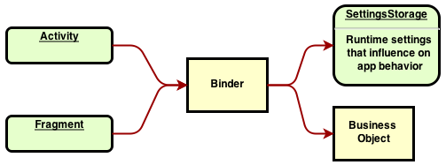

# binding-tc

*Second Name:* Android Easy Binding (AEB)

Android View properties binding to the Business Objects (POJO). 

# State [](https://travis-ci.org/OleksandrKucherenko/binding-tc)

Active development, started at: 2014-05-15

# Goals
* High performance, 
* easy syntax, 
* minimalistic approach, 
* highly customizable,
* hamcrest validation syntax,
* 100% covered by unit tests, TDD

#Prepare Environment

For development used latest Android Studio with gradle build scripts. For TDD used two frameworks: Robolectric and Espresso.

| *Robolectric Tests Executor* | *Espresso Tests Executor* |
|------------------------------|---------------------------|
|  |  |

#Binding In Details


# Example of Usage
Typical Business Object declared in POJO way:

```java
  public static class User{
    private String mLogin;
    private String mPassword;
  
    public String getLogin(){ return mLogin; }
    public String getPassword(){ return mPassword; }
  }
```
Fragment binding:

```java
import com.artfulbits.ui.binding.Binder;
import com.artfulbits.ui.binding.BindingManager;

import static com.artfulbits.ui.binding.toolbox.Converters.direct;
import static com.artfulbits.ui.binding.toolbox.Listeners.none;
import static com.artfulbits.ui.binding.toolbox.Models.pojo;
import static com.artfulbits.ui.binding.toolbox.Models.property;
import static com.artfulbits.ui.binding.toolbox.Views.matches;
import static com.artfulbits.ui.binding.toolbox.Views.root;
import static com.artfulbits.ui.binding.toolbox.Views.view;
import static com.artfulbits.ui.binding.toolbox.Views.withId;
import static org.hamcrest.core.IsAnything.anything;

/** Login fragment with simplest UI. */
public class PlaceholderFragment extends Fragment implements BindingManager.LifecycleCallback {

  private final BindingManager mBm   = new BindingManager(this).register(this);
  private final User           mUser = new User();

  public PlaceholderFragment() {
  }

  @Override
  public View onCreateView(LayoutInflater inflater, ViewGroup container, Bundle savedInstanceState) {
    final View view = inflater.inflate(R.layout.fragment_main, container, false);

    // custom Binding --> can be done at any point of the lifecycle
    Binder bindLogin = mBm.bind(view(matches(root(view), withId(R.id.et_login)), property("text")))
            .model(pojo(mUser, property("login")));

    // update view by model values
    mBm.pop(bindLogin);

    // update model by views values (can be executed more than one rule!)
    mBm.pushByInstance(mUser);

    return view;
  }

  @Override
  public void onCreateBinding(final BindingManager bm) {
    // custom LIFECYCLE step --> BindingManager.LifecycleCallback 
    final Binder bindPassword = bm
            .bind(view(withId(R.id.et_password), property("text")))
            .model(pojo(mUser, property("password")))
            .formatter(direct())
            .validator(anything())
            .listenOnModel(none())
            .listenOnView(none());
  }
}
``` 

# Extended lifecycle


AEB adding a new step into lifecycle ```onCreateBinding()``` it executed after the ```onAttachedToWindow()``` and before ```onCreateOptionsMenu()```.
 
# Generic Concept Overview



# Entities, Responsibilities

| Binder | Formatter |
|--------|-----------|
| extract getter and setter by reflection; | convert storage data type to view data type; |
| push and pop value into/from view; | apply formatting during convert operation; |
| attach/detach listeners; | extract value from view data type and \'reverse\' it to storage data type; |
| Trigger value push on change capture by listener. | |

| Validation | Storage |
|------------|---------|
| pre-process data before storing it; | store value in specific format; |
| validate data limits; | hide storage specifics; |
| attach custom listeners that needs binding results; |

| Listeners | Extractor |
|-----------|-----------|
| attach specific listeners to the view or storage, for runtime event based binding triggering; | reflect properties by name. Recognizing names: has\*, is\*, get\*, set\*, exceeds\*; |

| Manager |
|---------|
| find bindings by view reference; |
| find bindings by storage reference;  |
| force binding push; |
| force validation; |
| force binding pop; |
| global listeners; |

# License

    The MIT License (MIT)
    Copyright (c) 2014 Oleksandr Kucherenko
    Permission is hereby granted, free of charge, to any person obtaining a copy
    of this software and associated documentation files (the "Software"), to deal
    in the Software without restriction, including without limitation the rights
    to use, copy, modify, merge, publish, distribute, sublicense, and/or sell
    copies of the Software, and to permit persons to whom the Software is
    furnished to do so, subject to the following conditions:
    The above copyright notice and this permission notice shall be included in all
    copies or substantial portions of the Software.
    THE SOFTWARE IS PROVIDED "AS IS", WITHOUT WARRANTY OF ANY KIND, EXPRESS OR
    IMPLIED, INCLUDING BUT NOT LIMITED TO THE WARRANTIES OF MERCHANTABILITY,
    FITNESS FOR A PARTICULAR PURPOSE AND NONINFRINGEMENT. IN NO EVENT SHALL THE
    AUTHORS OR COPYRIGHT HOLDERS BE LIABLE FOR ANY CLAIM, DAMAGES OR OTHER
    LIABILITY, WHETHER IN AN ACTION OF CONTRACT, TORT OR OTHERWISE, ARISING FROM,
    OUT OF OR IN CONNECTION WITH THE SOFTWARE OR THE USE OR OTHER DEALINGS IN THE
    SOFTWARE.
